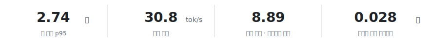
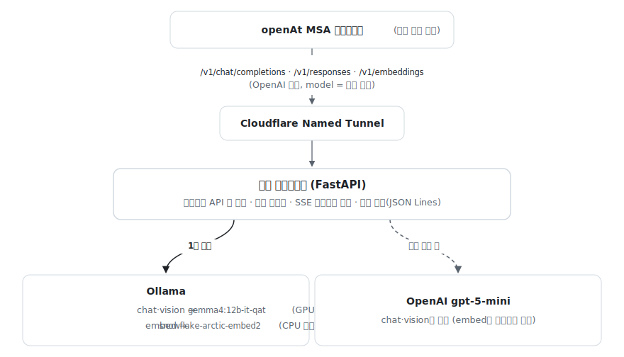

<div align="center">


<br />


<br />
<br />

<strong>보유 GPU를 팀 공용 추론 인프라로 전환한 OpenAI 호환 게이트웨이</strong>

<br />
<br />

정상 요청은 로컬 Ollama가 처리하고, 생성 경로에 장애가 발생한 경우에만 OpenAI로 우회한다.<br />
클라이언트는 OpenAI SDK와 기능별 모델 별칭만 사용하면 된다.

<br />
<br />

<a href="#핵심-성과">핵심 성과</a>
&nbsp;·&nbsp;
<a href="#요청-흐름">요청 흐름</a>
&nbsp;·&nbsp;
<a href="#빠른-연동">빠른 연동</a>
&nbsp;·&nbsp;
<a href="#장애-경계">장애 경계</a>
&nbsp;·&nbsp;
<a href="#운영과-검증">운영과 검증</a>
&nbsp;·&nbsp;
<a href="#문서">문서</a>

</div>

---

## 배경과 설계 방향

openAt 프로젝트에 RAG와 이미지 분석 기능이 추가되면서, 지원받아 사용하던 API 토큰 한도가 팀 전체의 병목으로 작용했다. 문제는 호출 횟수만이 아니었다. 제한된 토큰 예산은 상위 모델 선택과 충분한 추론량을 제약하고, 결국 LLM 연동 기능의 품질을 낮출 수 있었다. 이에 비용 절감 자체보다 외부 예산에 따라 품질이 결정되는 구조를 해소하는 것을 목표로 삼았다.

보유 중인 GTX 1080 Ti 11GB에서 로컬 모델의 실행 가능성을 먼저 확인한 뒤, 로컬 우선 추론 경로와 제한적인 외부 폴백을 갖춘 게이트웨이를 구축했다. 이후 로컬은 실제 운영 경로인 게이트웨이를 경유하고 비교 모델은 OpenAI API를 직접 호출한 상태에서, 텍스트 생성은 같은 문항과 각 모델의 저지연 일반 모드로, 임베딩은 같은 검색 표본으로 품질을 비교했다. 로컬 단건 응답 속도도 사전에 정한 기준으로 검증했다. 그 결과 로컬을 기본 추론 경로로 유지하고, 로컬 생성 경로가 요청을 처리할 수 없는 경우에만 외부 모델로 보완할 근거를 확보했다.

| 로컬 우선 처리 | 단일 API 계약 | 제한적인 외부 폴백 |
|---|---|---|
| 텍스트 생성·이미지 분석·임베딩을 보유 장비에서 우선 처리한다. | 클라이언트에는 필요한 범위의 OpenAI 호환 API만 제공한다. | 유효한 요청을 로컬 생성 경로가 처리할 수 없을 때만 외부 모델로 전환한다. |

실제 모델 매핑과 장애 처리는 게이트웨이가 담당한다. 클라이언트는 `base_url`, API 키, `chat`·`vision`·`embed` 별칭만 알면 된다.

## 핵심 성과

성능과 품질은 실제 운영 경로를 거치는 요청으로 측정했고, 비용은 실측 전력에 전기요금 단가를 적용해 추산했다. 평가 중에는 외부 폴백을 비활성화해 모든 응답이 로컬 경로에서 생성되도록 했다. 그 상태에서 사전에 정의한 안정성·체감 성능·품질·비용 기준을 모두 충족했다.

<div align="center">



</div>

질의당 예상 전기요금 약 0.028원은 실측 전력과 적용 단가를 바탕으로 계산한 추정치다. 이미 보유한 장비의 구입비·유휴 전력·운영 비용은 포함하지 않았다.

### 추론 평가

| 평가 | `gemma4` 일반 | `gpt-5-mini` | `gpt-5.4-nano` |
|---|---:|---:|---:|
| KMMLU | 31/48 | 32/48 | 32/48 |
| 자체 고난도 | **16/18** | 14/18 | 12/18 |
| 함정·형식 심판 점수 | **8.89** | 7.67 | 7.11 |

로컬 일반 모드는 KMMLU에서 비교 모델과 비슷한 수준을 기록했고, 프로젝트 고난도 과제와 블라인드 심판 평가에서는 더 높은 점수를 받았다. 이 결과로 로컬 경로가 단순한 저비용 대안이 아니라, 외부 토큰 제약으로 기능 품질을 낮추지 않기 위한 기본 추론 경로가 될 수 있음을 확인했다. 사고 모드는 고난도 과제에서 17/18까지 향상됐지만 평균 응답 시간이 80.0초였다. 따라서 정확도가 지연 시간보다 중요한 요청에만 선택적으로 사용한다.

[추론 평가 설계·문항별 점수·해석](docs/BENCHMARK_RESULTS.md#서비스-생성-품질)

### 임베딩 평가

| 모델 | Recall@1 | Recall@3 | MRR |
|---|---:|---:|---:|
| `snowflake-arctic-embed2` 로컬 | **22/24** | **24/24** | **0.96** |
| `text-embedding-3-small` | 21/24 | 23/24 | 0.91 |

CPU에서 실행한 로컬 임베딩은 프로젝트 검색 데이터셋에서 세 지표 모두 비교 모델보다 높은 결과를 기록했다.

[임베딩 데이터·측정 조건·해석](docs/BENCHMARK_RESULTS.md#임베딩-검색-품질)

> [!IMPORTANT]
> 동시 요청 8건을 처리하는 동안 오류나 GPU 메모리 초과는 발생하지 않았지만, 첫 토큰 p95는 40.4초까지 증가했다. 실제 사용 환경에서 동시 요청이 많아진다면 대기열과 라우팅 정책을 별도로 조정해야 한다. 전체 측정값과 한계는 [벤치마크 결과](docs/BENCHMARK_RESULTS.md), 운영 판단과 후속 과제는 [벤치마크 피드백](docs/BENCHMARK_FEEDBACK.md)에 정리했다.

## 요청 흐름

<div align="center">



</div>

1. Cloudflare Named Tunnel은 FastAPI 게이트웨이만 외부에 공개한다.
2. 게이트웨이는 인증 정보·요청 형식·모델 별칭을 검증한 뒤 업스트림을 호출한다.
3. 검증을 통과한 요청은 GPU 생성 인스턴스 또는 CPU 임베딩 인스턴스로 전달된다.
4. 로컬 생성 경로를 일시적으로 사용할 수 없는 경우에만 `gpt-5-mini`로 우회한다.
5. 모든 요청은 `x-request-id`로 식별되고 JSON Lines 형식의 관측 로그에 기록된다.

Ollama 인스턴스는 외부에 직접 노출하지 않는다. 실제 모델 매핑과 회로 차단기 상태, 폴백 적용 여부는 서버 설정과 런타임 상태를 기준으로 게이트웨이가 결정한다.

## 빠른 연동

OpenAI SDK의 호출 방식은 유지하고, 접속 정보와 모델 별칭만 변경하면 된다.

```python
from openai import OpenAI

client = OpenAI(
    base_url="https://<public-host>/v1",
    api_key="<게이트웨이 발급 키>",
)

reply = client.chat.completions.create(
    model="chat",
    messages=[
        {
            "role": "user",
            "content": "주문 지연 안내 문구를 만들어 줘",
        }
    ],
)

print(reply.choices[0].message.content)
```

`model="chat"`은 실제 모델명이 아니라 기능을 나타내는 별칭이다. 서버의 모델 매핑이 바뀌어도 클라이언트 코드는 수정할 필요가 없다.

### 지원 별칭

| 별칭 | 엔드포인트 | 용도 |
|---|---|---|
| `chat` | `/v1/chat/completions` | 텍스트 생성·스트리밍 |
| `vision` | `/v1/chat/completions` | 이미지 분석 |
| `embed` | `/v1/embeddings` | 로컬 임베딩 생성 |
| `gpt-5.4-nano` | `/v1/responses` | 기존 검색 모듈 호환용 비스트리밍 이미지 분석 |
| `text-embedding-3-small` | `/v1/embeddings` | 기존 검색 모듈 호환용 1536차원 출력 |

전체 요청·응답 형식과 오류 규격은 [API 연동 가이드](docs/API.md)에 정리했다.

> [!WARNING]
> 로컬 임베딩과 OpenAI 임베딩은 출력 차원이 같아도 서로 다른 벡터 공간을 사용한다. `provider`를 전환하거나 롤백할 때는 기존 벡터와 새 벡터를 섞지 말고 전체 색인을 다시 생성해야 한다.

## 장애 경계

폴백은 모든 오류를 감추기 위한 기능이 아니다. 형식과 인증이 유효한 요청을 로컬 생성 경로가 처리하지 못한 경우에만 외부 모델로 전환한다.

| 상황 | 게이트웨이 동작 |
|---|---|
| 인증 실패·미등록 별칭·잘못된 요청 | 업스트림을 호출하지 않고 OpenAI 호환 오류를 즉시 반환 |
| 로컬 생성 경로의 연결 실패·시간 초과·서버 오류 | 별칭별 정책에 따라 OpenAI로 우회 |
| 회로 차단기 열림 | 장애가 발생한 로컬 경로를 건너뛰고, 대기 시간이 지난 뒤 복구 여부 확인 |
| 임베딩 경로 장애 | 벡터 공간 정합성을 위해 다른 모델로 우회하지 않음 |
| 스트리밍 첫 유효 이벤트 이전 장애 | 정책에 따라 다른 `provider`로 전환 가능 |
| 스트리밍 첫 유효 이벤트 이후 장애 | 서로 다른 모델의 출력을 섞지 않고 스트림 종료 |

이 구분을 통해 클라이언트 오류는 빠르게 드러내고, 생성 응답의 연속성과 임베딩 색인의 정합성은 각각의 기준에 맞게 보호한다.

## 운영과 검증

### 운영

게이트웨이, GPU·CPU Ollama 인스턴스, 터널, 감시 프로세스는 서로 독립적으로 실행한다. Windows `SYSTEM` 예약 작업은 일반 작업 트리가 아니라 관리자만 수정할 수 있는 별도 배포 사본을 사용한다.

| 운영 실측 | 결과 |
|---|---:|
| 서버 재부팅 후 사용자 로그인 없이 전 기능 복구 | 4.91분 이내 |
| 게이트웨이 강제 종료 후 복구 | 5.4초 |

서비스별 API 키는 원문 대신 해시만 저장하며, 필요할 때 개별 폐기할 수 있다. 온디맨드 경량 모니터는 프로세스 상태와 함께 관측 로그의 요청 수·오류율·지연 시간·`provider` 분포를 보여 준다.

[배포·복구·키 관리·모니터링 절차](docs/OPERATIONS.md)

### 검증

| 검증 단계 | 확인한 범위 |
|---|---|
| 자동화 테스트 | 계약·라우팅·회로 차단·스트리밍·임베딩 변환 등 554건 |
| 결정적 통합 검증 | 로컬 모의 업스트림으로 성공·장애·복구 경로 재현 |
| 라이브 검증 | 실제 Ollama·OpenAI·Cloudflare 경로와 운영 복구 절차 실측 |
| MSA 연동 | 검색 모듈 호환 계약 검증 완료·실제 클라이언트 E2E 검증 대기 |

```powershell
uv sync
uv run ruff check
uv run ruff format --check
uv run pytest
```

단계별 검증 범위와 실측 기록은 [로드맵](docs/ROADMAP.md)에 정리했다.

## 문서

| 문서 | 내용 |
|---|---|
| [API 연동 가이드](docs/API.md) | 지원 엔드포인트·별칭·요청·응답·오류 계약 |
| [운영 가이드](docs/OPERATIONS.md) | 배포 사본·`SYSTEM` 실행 경계·키 관리·복구·모니터링 절차 |
| [벤치마크 결과](docs/BENCHMARK_RESULTS.md) | 실행 환경·평가 설계·전체 점수·비용 산정·재현 경로 |
| [벤치마크 피드백](docs/BENCHMARK_FEEDBACK.md) | 결과 해석·운영 제약·후속 라우팅 과제 |
| [결정 이력](docs/DECISIONS.md) | 맥락·검토한 대안·트레이드오프를 포함한 시간순 설계 결정 |
| [로드맵](docs/ROADMAP.md) | 9단계 구현 범위와 단계별 검증 기록 |
